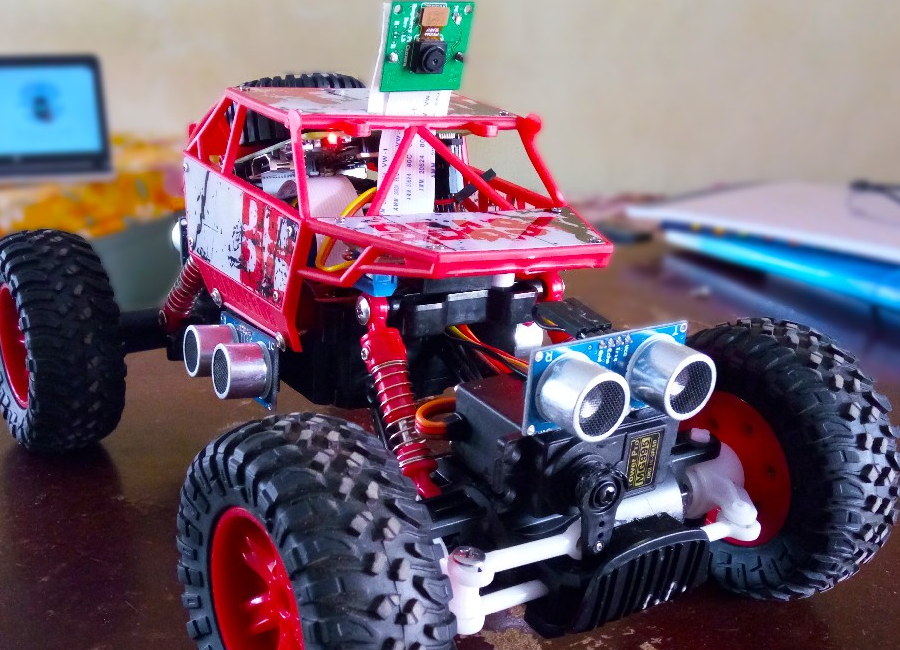

# Pi car

B.tech final year project by Chirath R and Akshay C V.

An autonomous car is a vehicle that is capable of sensing its environment and navigating without human input. 
Autonomous cars can detect surroundings using a variety of techniques such as radar, lidar, GPS, odometry, and 
computer vision. Advanced control systems interpret sensory information to identify appropriate navigation paths, 
as well as obstacles and relevant signage. Autonomous cars have control systems that are capable of analyzing sensory 
data to distinguish between different cars on the road, which is very useful in planning a path to the desired 
destination.

This project implements a low cost autonomous model that can be used to make road travel safer and more comfortable 
for commuters. We used low cost components like Raspberry Pi and a L298N motor controllers to run a light weight 
algorithm. The project also uses camera and an array of ultrasonic sensors as input to the algorithm. The actuators 
in the project are two DC motors and a servo motor to control the direction.

The algorithm consists of an artificial neural network that takes input from the camera and predicts the driving 
direction of the car. This neural network is build using a an artificial neural network with 38,400 nodes in the 
input layer, 24 nodes in the hidden layer and 3 nodes in the output layer. The artificial neural network takes a 
gray scale image of size(320 x 120) as input to the nodes. The network predicts then predicts one of the outputs as 
either forward-left(node 1), forward(node 2) or forward-right(node 3). These predictions are converted into a direction 
vector and passed on to the motor module that then sends the required control signals to the motors.

The training data is collected by driving the car manually through a track. The car records images at the rate 
of 12 frames per seconds and sends it to the server though the local Wi-Fi connection. The image is taken from the 
Raspberry pi camera module at a resolution of 320 x 240. Then the Python OpenCV module is used to convert the image 
into gray scale and compressed using JPEG standard. This image is then converted into a 1-D matrix using Numpy and 
then converted into a stream of bytes. These stream of bytes are then send over the network to the server program 
running on TCP socket 8001. The server program get the stream of bytes from the socket and converts it back to a 1-D 
matrix of image data of length 38400 values. Each of these values represent a pixel in the image and is to be used 
as input to the nodes in the neural network.  

Another thread captures the input from the keyboard, while a human driver drives the car around the track. 
At any instance this data is used to label the incoming frames either forward-left(0), forward(1) or forward-right(2). 
The image and label is then stored as Numpy array after the training data collection process completes. This data is 
later used to train the machine learning algorithm.

We took about 1 hour of training data and left the model to train on an AWS cloud instance for a day. After each set 
of training data of about 10 mins the algorithm showed an improvement in accuracy of about 1-2\%. At the end of the 
training session we were able to get about 67\% accuracy. This meant that with enough data we could indeed get 
a high accuracy.

All the software for this project runs on a Raspberry Pi 3 model B+ which runs a Debian based Linux OS called Raspbian. 
We used Python 2 with OpenCV, Numpy, Raspi-GPIO and Pi-camera to develop the software required to self drive the car. 
There are six different modules, three each on the server and client. These there sever modules run as different 
processes on TCP ports 8000, 8001 and 8002. Two client modules connect to two of the three TCP ports and on request 
from the server provides information to the server. The main port(8000) is used by the main driver program to provide 
driving direction command to the client motor module. The driving direction is calculated from the prediction of the 
neural network and also by using the information from the Ultrasonic sensor modules.

## Hardware

- An RC car model with motors and controllers.
- Raspberry pi 3 model B (with WiFi).
- Raspberry pi 5MP camera (For video I/P).
- Ultrasonic ranging Modules (For distance I/P).
- L298 Motor Driver Module.
- Servo motor for direction control.
- 4 x 18650 Li-ion batteries
- Charging module for charging the Li-Ion batteries.
- Wires, connectors, tape, glue, solder iron, lead
- item Laptop with Linux OS.

### Motor controller layout

### Final prototype

